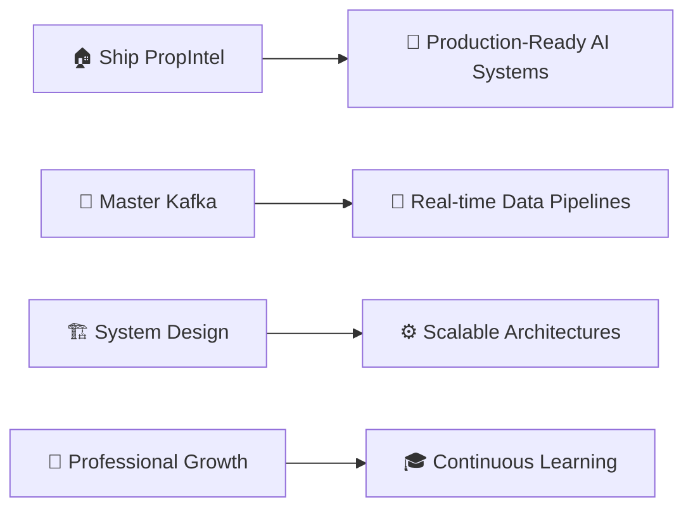

# 
👋 Hello World! I'm **Vedansh Rathi** 🚀

  

  

---

## 🎯 **What I'm Up To**

<table>
<tr>
<td width="50%">

### 🔭 **Currently Building**
- 🏠 **PropIntel** — AI-powered real estate intelligence & document validation platform for NBFCs, leveraging OCR, NLP & ML
- 🌐 Contributing to **Open Source** projects

### 🌱 **Currently Exploring**
- 🔷 **Kafka** — real-time event streaming
- 🏗️ **System Design** — scalable distributed architectures
- 🤖 **AI/ML Integration** — NLP & document intelligence

</td>
<td width="50%">

### 🎓 **Experience**
- 💼 **Full Stack Web & App Developer**
- 🧠 Focused on building **AI-powered & high-performance systems**
- 🔍 Designing **robust microservice architectures**

### 🤝 **Open to Collaborate**
- 🚀 **Full-Stack Development** projects
- 🌟 Meaningful **Open Source** contributions
- 📈 **System Design & Architecture** challenges

</td>
</tr>
</table>

---

## 🌐 **Connect With Me**

---

## 💻 **Tech Arsenal**

### **Languages**

### **Frontend / Mobile Development**

### **Backend Development**

### **Databases**

---

## 🚀 **Featured Projects**

### 🏠 PropIntel — AI-Powered Real Estate Intelligence Platform

> *Automating property document verification for financial institutions using AI*

| Feature | Details |
|---|---|
| 🔍 **OCR & NLP** | Extracts structured & unstructured data from term sheets, agreements & property records |
| 🤖 **ML Validation** | Cross-validates data against master datasets to detect anomalies & fraud |
| 🏦 **Target Users** | NBFCs and financial institutions involved in property-based lending |
| ✅ **Impact** | Faster decisions, improved compliance & reduced financial risk |

---

### 📚 GyaanSetu — Offline AI Learning Platform

> *Vernacular STEM tutoring for students in low-connectivity regions — powered by on-device AI*

| Feature | Details |
|---|---|
| 📱 **Offline-First** | End-to-end offline mobile app with on-device AI inference & React Native frontend |
| 🔎 **RAG Pipeline** | Sentence Transformer embeddings + FAISS vector indexing for sub-second semantic search |
| ⚡ **FastAPI Inference** | Scalable real-time embedding generation endpoints for educational content |
| 📄 **Auto Ingestion** | OCR-powered PDF-to-knowledge-base pipeline — zero manual content processing |

---

## 🐍 **Contribution Snake**

<picture>
  <source media="(prefers-color-scheme: dark)" srcset="https://raw.githubusercontent.com/7Vedansh/7Vedansh/output/github-snake-dark.svg" />
  <source media="(prefers-color-scheme: light)" srcset="https://raw.githubusercontent.com/7Vedansh/7Vedansh/output/github-snake.svg" />
  
</picture>

---

## 📊 **GitHub Analytics**

  

---

## 💭 **Daily Inspiration**

---

## 🎯 **Current Goals for 2025**

---

---

## 🐍 Contribution Snake

<picture>
  <source media="(prefers-color-scheme: dark)" srcset="https://raw.githubusercontent.com/7Vedansh/7Vedansh/output/github-snake-dark.svg" />
  
</picture>

---

