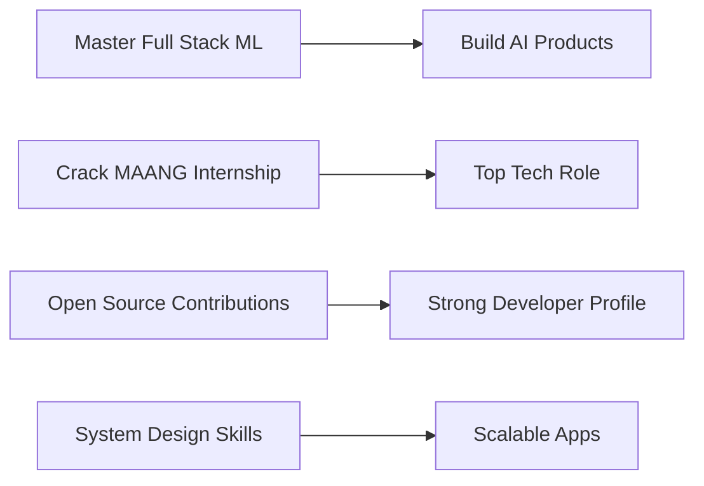

<h1 align="center">Hi 👋, I'm Vedansh Rathi</h1>
<h3 align="center">🚀 Full Stack Developer | Machine Learning Enthusiast | Future MAANG Engineer</h3>

---

## 🧑‍💻 About Me

* 🎓 Engineering Student passionate about building real-world tech
* 🤖 Exploring **Machine Learning, AI & Data-driven Systems**
* 🏗️ Currently building **PropIntel – AI-powered real estate intelligence system**
* 📱 Learning **Flutter → Backend → Full Stack Development**
* 🎯 Goal: Crack **MAANG-level roles** with strong projects & system design
* ⚡ Love solving real-world problems with scalable tech

---

## 🌐 Connect With Me

<a href="https://linkedin.com/in/YOUR_LINKEDIN" target="blank">LinkedIn</a> •
<a href="mailto:YOUR_EMAIL@gmail.com">Email</a> •
<a href="https://github.com/YOUR_USERNAME">GitHub</a>

---

## ⚡ Tech Stack

### 💻 Languages

### 🎨 Frontend / Mobile

### ⚙️ Backend & Database

### 🤖 AI / ML

---

## 🚀 Projects

### 🔹 PropIntel

> AI-powered real estate validation & intelligence system

* 📄 Extracts structured/unstructured data from documents
* 🔍 Detects inconsistencies & fraud risks
* ⚡ Automates validation for NBFCs & financial institutions

---

## 📊 GitHub Stats

---

## 🏆 Achievements & Activity

---

## 🔥 Contribution Stats

---

## 🎯 2026 Goals

---

## 💡 Quote I Believe In

> "First solve the problem, then write the code."

---

## 👀 Profile Views

---

## ⭐ Let's Connect & Build

🚀 Always open to collaboration on impactful projects
💡 Let’s build something that actually matters
