

  

  

---

## 🌐 **Connect With Me**

<h5 align="center">
  <code><a href="https://linkedin.com/in/7Vedansh/" title="LinkedIn Profile"> LinkedIn</a></code>
  <code><a href="mailto:vedanshrathi765@gmail.com" title="Email"> Email</a></code>
  <code><a href="https://7vedansh.vercel.app" title="Portfolio">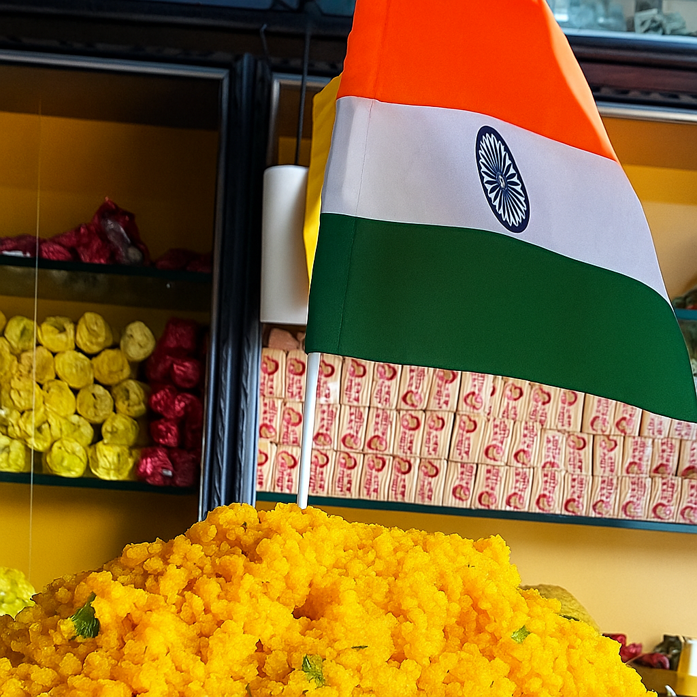 Portfolio</a></code>
</h5>

---

<h2 align="center">🔥 Languages & Frameworks & Tools & Abilities 🔥</h2>
 

  <code></code>
  <code>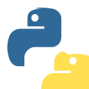</code>
  <code>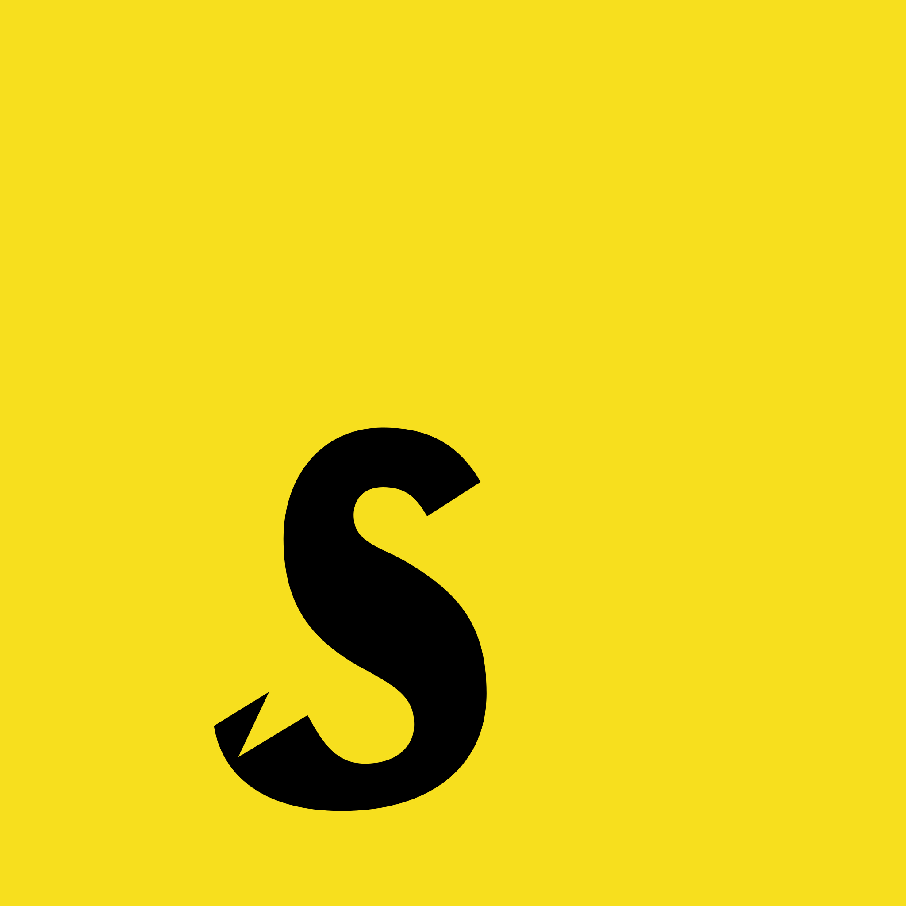</code>
  <code>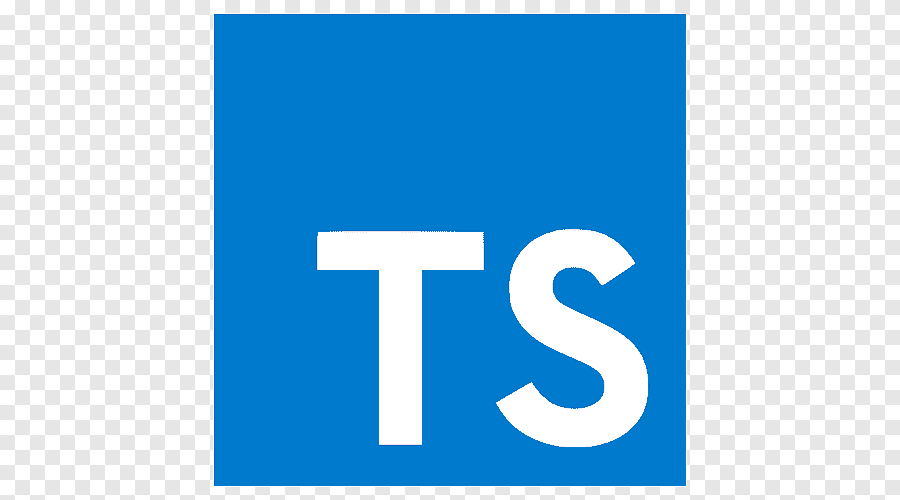</code>
  <code></code>
  <code></code>
  <code>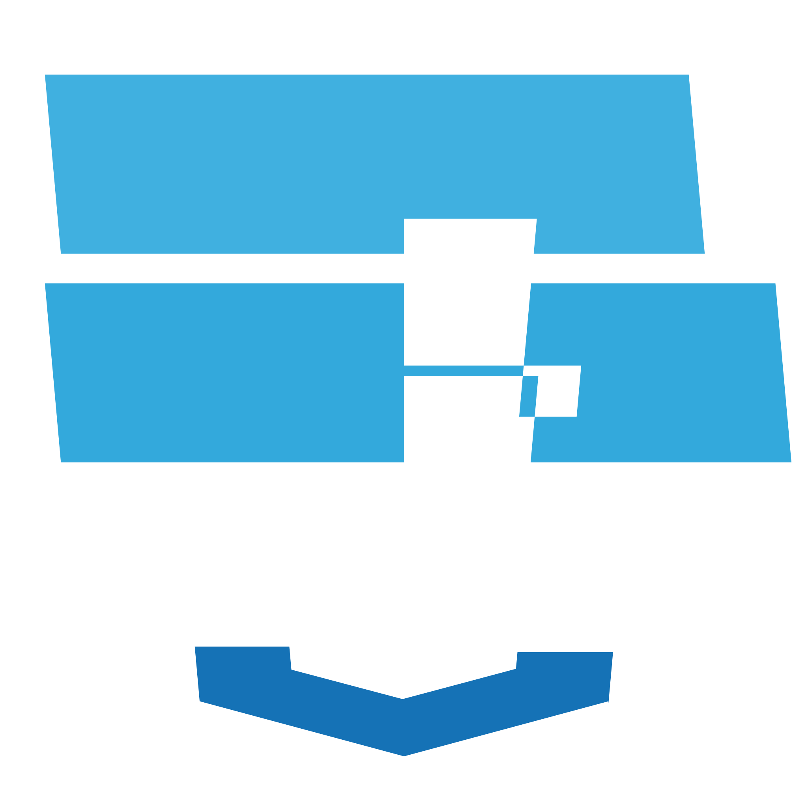</code>
  <code>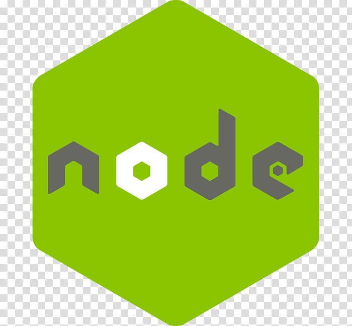</code>
  <code></code>
  <code>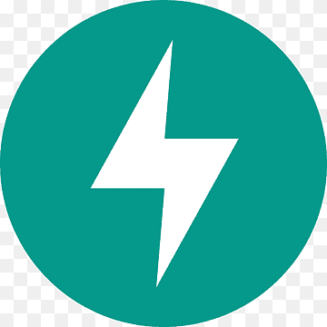</code>
  <code></code>
  <code></code>
  <code></code>
  <code>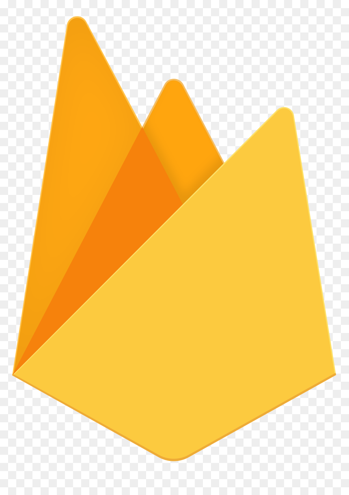</code>
  <code>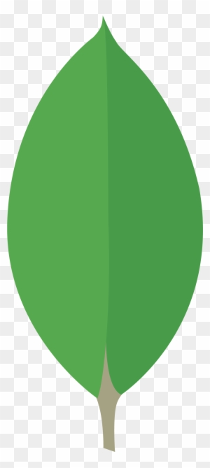</code>
  <code></code>
  <code></code>
  <code>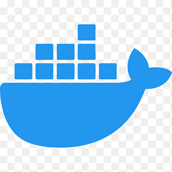</code>
  <code></code>
  <code>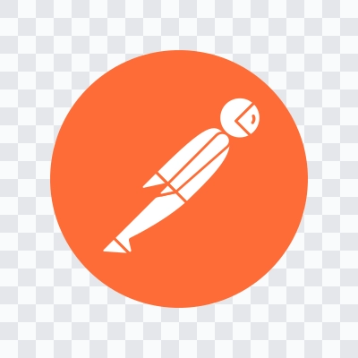</code>
  <code>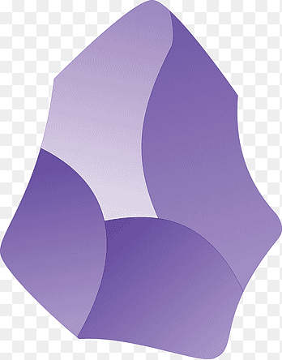</code>
  <code></code>

---

## 🐍 **Contribution Snake**

<picture>
  <source media="(prefers-color-scheme: dark)" srcset="https://raw.githubusercontent.com/7Vedansh/7Vedansh/output/github-snake-dark.svg" />
  <source media="(prefers-color-scheme: light)" srcset="https://raw.githubusercontent.com/7Vedansh/7Vedansh/output/github-snake.svg" />
  
</picture>

---

### 🌟 **"Code is like humor. When you have to explain it, it's bad."** 🌟

**Thanks for visiting! Let's build something amazing together! 🚀**

  

