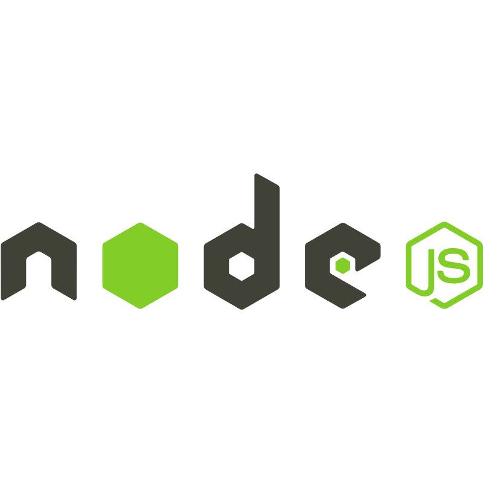

---

## 📌 About Me

👋 Hi, I’m **Vedansh Rathi**  
💻 Passionate about **Coding, Problem Solving, and Entrepreneurship**  
🚀 Currently working on **Web Development & AI-based Projects**  
🧠 Interested in **System Design and Scalable Architectures**  
📫 Reach me at: **vedanshrathi765@gmail.com**

---

---

<h2 align="center">🔥 Tech Arsenal 🔥</h2>

  <code></code>
  <code></code>
  <code></code>
  <code></code>
  <code></code>
  <code></code>
  <code></code>
  <code></code>
  <code></code>
  <code></code>
  <code></code>
  <code></code>
  <code></code>
  <code></code>
  <code></code>
  <code></code>
  <code></code>
  <code></code>
  <code></code>
  <code></code>

---

### 🌟 *"Code is like humor. When you have to explain it, it's bad."* 🌟

